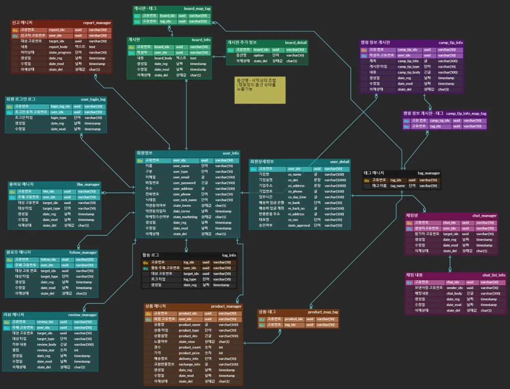
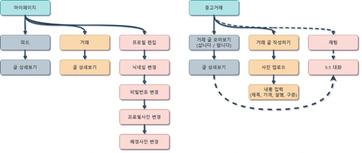
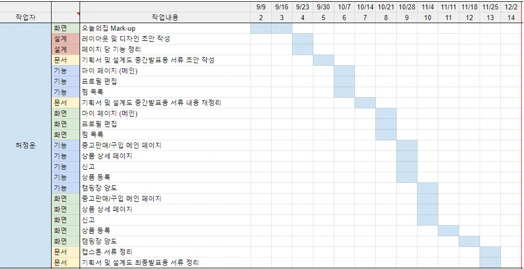

2022년 2학기 CCIT 융합전공 기업수주형 프로젝트

    

### 🎯&nbsp;Subject

> 기업수주형 프로젝트 캠핑종합플랫폼 BEARS 

### 🗓️&nbsp;Date

> 2022.09 ~ 2022.12

### 📄&nbsp;Document

> [기획서.pdf](public/doc/projectDesign.pdf) 
> [presentation.pdf](public/doc/presentation.pdf) 
> [화면설계서(기능).pdf](public/doc/화면설계서(기능).pdf)
> [화면설계서(디자인).pdf](public/doc/화면설계서(디자인).pdf)

### 🚀&nbsp;Intro & Function

> 팬데믹으로 인해 가까운 사람들과만 시간을 보내는 차박이나 프라이빗 캠핑의 소요가 상당히 증가하였고, 최근에는 팬데믹이 해소되면서 증가 했던 소요가 더 증폭되어 인기있는 취미 생활로 각광받고 있습니다. 하지만 관련 서비스가 빠르게 증가하는 관심도를 따라가지 못하여 정보 수집에 시간을 불필요하게 많이 할애하고 있습니다.
또한 캠핑이라는 취미 자체가 다른 취미에 비해 이용 빈도가 높지 않아서 주 1-2회도 정말 많이 즐기는 하드한 캠퍼들이나 가능할 정도이며 보통은 월 1-2회로 매우 적은 편입니다. 장비의 유휴 기간이 긴 편이고, 장비를 일정 수준 이상 갖춰야 즐길 수 있는 취미이기 때문에 접근성도 매우 열악한 상황입니다.
따라서, 이와 같은 문제들을 해소하는데 도움을 줄 수 있는 종합 캠핑 플랫폼을 구상하게 되었습니다.
>
> #### 담당 주요 기능
> 
> - 프로젝트 매니저(PM) 담당
> - 설계: 레이아웃 및 디자인 초안 작성, 요구사항/기능 정리
> - 문서: 기획서, 설계도, 발표용 ppt
> - 프론트: 마이페이지 - 메인, 프로필 편집, 찜 목록 / 중고거래 - 메인, 상세, 신고, 상품 등록, 예약 캠핑장 양도

### 📚&nbsp;Tech Stack

### 📂&nbsp;ERD

    

### ⚙️&nbsp;All Features

---

#### 기능 정리

- 계정
  - 로그인
  - 회원가입
  - 프로필사진 교체
  - 닉네임 변경
  - 내가 작성한 게시물 노출 (삭제 가능)
  - 프로필 정보 노출 (프로필 사진, 이름, 팔로우 수, 팔로워 수)
  - 환경설정
  - 비밀번호 변경
  - 알림 설정
  - 로그아웃
  - 계정 탈퇴

- 메인화면
  - 배너 1
  - 배너 2
  - 키워드 검색 (태그, 사람, 장소)
  - 카테고리 검색

- 커뮤니티 (SNS)
  - 게시물
    - 사진, 동영상 업로드
    - 커뮤니티 글 등록
    - 카테고리 입력
    - 해시태그 (커스텀 태그, 예: #오늘도)
    - 좋아요
    - 북마크 (게시물 저장)
    - 댓글 (2차원, 대댓글)
      - 신고 기능
    - 신고 (차단)
    - 공유 (링크)
  - 팔로우
    - 유저 팔로우
    - 팔로우 시 유저 게시물 알림 설정
  - 태그 (상품, 사람, 장소)

- 마이페이지
  - 내 정보 노출 (이메일, 이름, 성별, 생일, 전화번호)
  - 고객센터 (고객센터 정보 노출)
  - 약관 (정책 필요)
  - 가이드 (정책 필요)

- 캠핑 정보
  - 캠핑장 정보 제공
    - 장소, 인원, 계절, 숙박 일수
    - 구분 (글램핑, 캠핑, 백패킹, 노숙, 차박, 오토캠핑, 캠핑카)
    - 편의시설 (편의점, 약국, 식사, 카페, 화장실, 식수대, 샤워장, 주차 가능 여부)
  - 주변 검색
    - 캠핑장 주변 맛집, 명소, 마트
    - 입점사 캠핑장 링크
  - 캠핑 사전
    - 캠핑 용어 및 정보 제공 (자유 게시판: 입점사, 전문가)
  - 캠핑 음식
    - 레시피, 음식 추천 (자유 게시판: 입점사, 전문가)

- 마켓
  - 거래 유형
    - B-C (기업-소비자)
    - C-C (소비자-소비자)
  - 기능
    - 구매
    - 판매
    - 장바구니
    - 찜
    - 결제
    - 신고
    - 문의 (실시간 1:1 채팅)
    - 리뷰 (텍스트)
    - 평점 (점수)
    - 배송 정책 (정책 필요)
    - 상품 정보 (이미지, 소개, 제목 등)
    - 옵션 선택
    - 할인 쿠폰 (정책 필요)
    - 비슷한 상품 추천 (조건 필요)

### ⚙️&nbsp;What I did

---

#### 마이페이지, 중고거래 개발

#### 개발 일정

